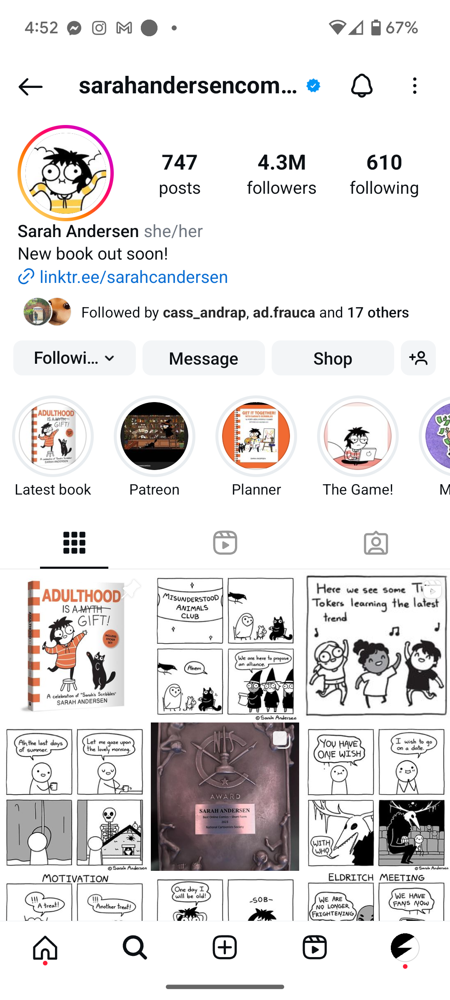
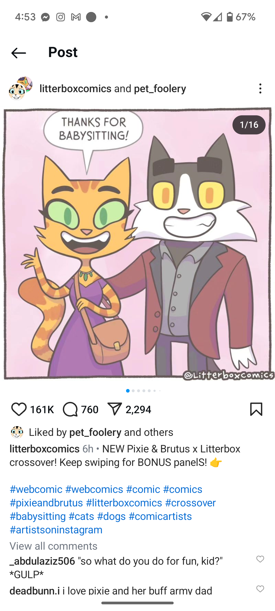
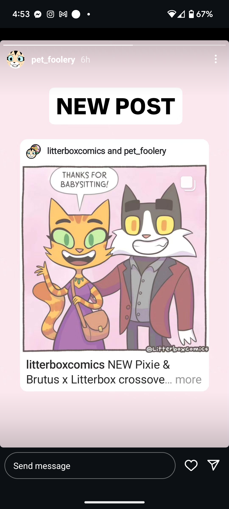
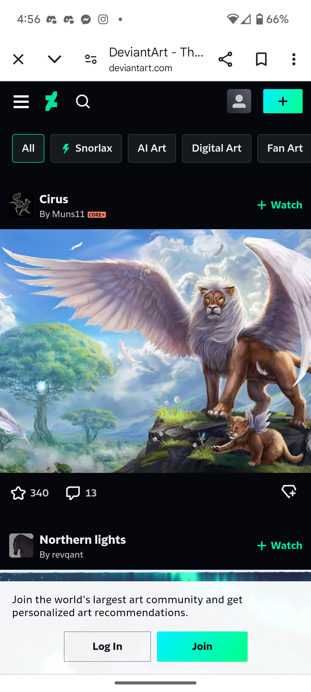
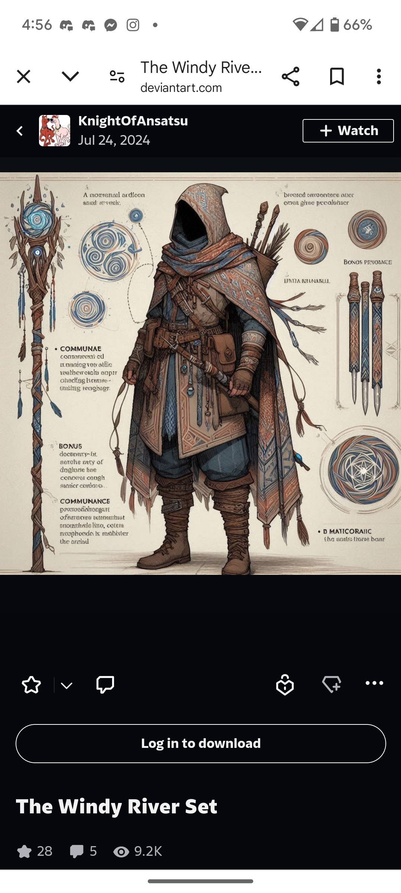
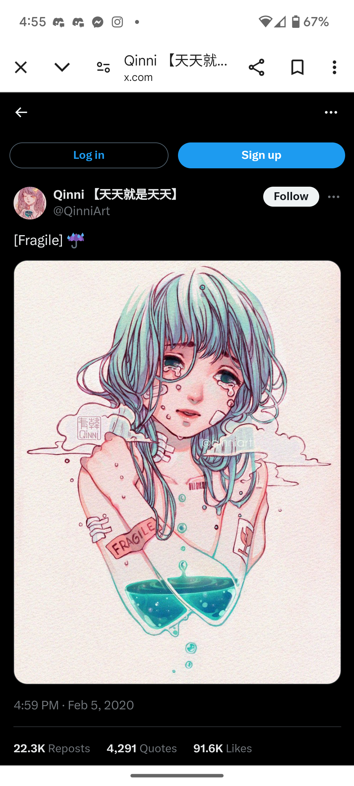

# ArtClick (working name)

### An app made for artists and art lovers.
Artists of any field, whether photgraphers, digital, graffiti, sculptures, or beyond; will be able to post and engage with other artists and those that enjoy their work, all while making sure that no one steals their work. Art enthusiasts will be able to see these pieces, make comissions, and engage with others; all while making sure that they are interacting with the original artists.

## How other apps interact with artists

    </img>
    
An artist's user page on Instagram. It displays their work, but all mixed together and only in chronological order.

    </img>
    
Post for a comic. It has a good layout and button placement, although having the tags before the comments feels like interaction is secondary.

    </img>
    
Artist promoting on Instagram. There isn't much they can do to promote their work.

    </img>
    
DeviantArt home feed. Having tags on top is good, but maybe re-order the post buttons.

    </img>
    
DeviantArt page for selling art. It's simple, but effective.

    </img>
    
Artist post on X. While it's easy to see the engagement on the post, it doesn't allow for a larger range of reactions.

## Possible Ideas:
- Reverse Image searching on post
- Strike and appeal system
- Social Media monitoring (other platforms)
- Live Streaming
- Public/Private groups
- Commision page
- Event organizing
- Automatic cross-posting
- Donations page
- Short-form vertical video
- Long-form video
- Automatic tagging
- In-built video stiching
- Being able to upload different files (RAW images and videos, Layers in digital art, etc)
- Layer view for digital art
- RAW view for photos
- Tagging
- Filtering and Blacklisting
- New Artist/Project Feed
- Project history page
- Canvas/paper scanning

## VSD Analysis
### Stakeholders
Our direct stakeholders would be artists and enthusiasts. Artists would use Artclick to post comissions and art for sale, interact with the larger community, and monitor for cases where their art may have been used without permission. This would allow for them to reach a larger audience. Art enthusiasts would be able to find people with similar tastes, including artists, and interact with them.

The indirect stakeholders are both reposters, people protected under fair use, and people making fan accounts. Reposters would find it harder to gain traction, as creators would be able to report them more easily. For fan accounts and fair use, there could be issues of artists using Artclick to try to strike down these accounts. However, most platforms have an appeal method to counteract this.

### Time
#### Short term
In the short term, we would see artists slowly joining the platform. By getting artists to join, even if it's smaller artists slowly, we would incentivize our direct stakeholders to also come to the platform.

#### Medium Term
Medium term effects would lead to ArtClick gaining a large user base. This would nudge well-known artists to join and help increase both the credibility and enthusiast stakeholder user count.

#### Long Term
Once in the long term, ArtClick would have an established user base. This larger adoption would allow ArtClick to have better conenctions with other platforms, helping improve the cross-posting and reporting capabilities from ArtClick.

### Pervasiveness
Widespread adoption would mean that a lot of regulation would have to come to ArtClick, especially as artists and art enjoyers with many different tastes would come to the platform. This would mean being careful on who can view what, as well as trying to reduce content that would cause problems or offensive. However, filtering would have to be limited, if not we can loose users due to limiting how creative artists can be on the platform. 

### Values
#### Autonomy
The only widespread limitation to autonomy would be making sure artists have approriately rated their content for different age groups, and that no illegal content is uploaded to ArtClick. Beyond that, both artists and art enthusiasts should be able to freely browse the site for content they would enjoy.

#### Community
ArtClick is community focused. It lives and dies by fostering a strong community between its users, so we need to allow users to be able to interact in real time, in real life or virtually, and limit interaction between each other. Failing to do this would mean ArtClick failed in it's main purpose.

#### Inclusion
Any and all will be welcome. The only who shouldn't be on the platform are those who's art is in of itself illegal or who's art is intended to attack a groups core ideals.

#### Fairness
We should try to avoid giving larger artists or large backers preferential treatment, all while making sure smaller artists still get their time to shine.

## Sketching
<!-- Apologies for the aweful drawing skills -->
[Flow 1: Posting and Cross-Posting](../img/a2/flow-1.png)

[Flow 2: Making and Getting comissions](../img/a2/flow-2.png)