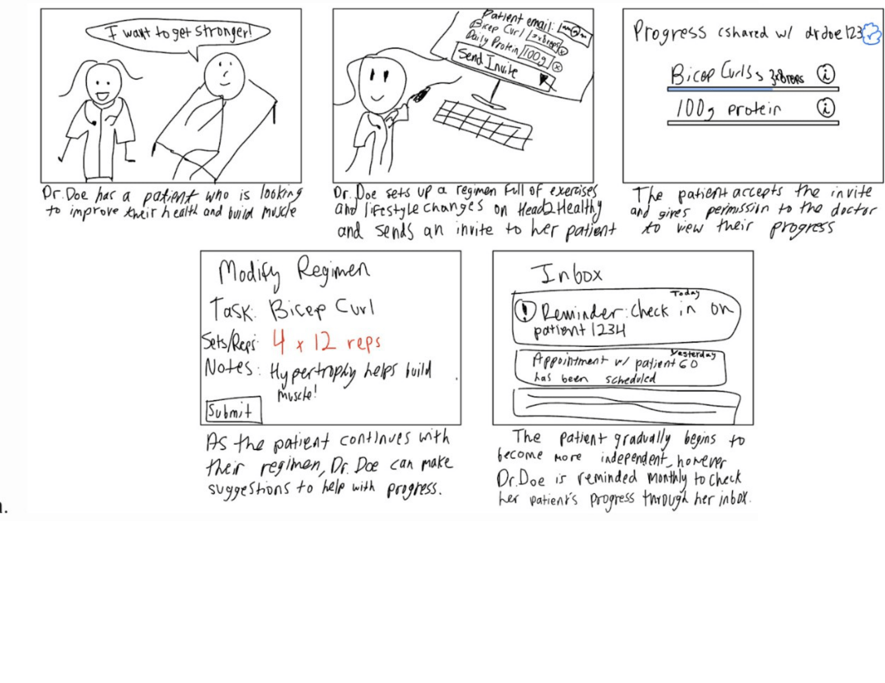

# **Project Phase 2: Divergent Design**

###### Binary Beasts

###### Claire Lorenzo, Cameron Young, Marcelo Maza, Fabian Yanez-Laguna

### Broad application goals

**Name:** Head2Healthy

**Audience:** people who do not have the time or resources to overcome barriers to a healthy lifestyle, medical professionals and fitness experts who want to further support their patients

**Value:**

- Direct and consistent access to medical professionals, which most health apps don’t have
- Tracks several different health metrics (most usually focus on one)
- Personalized health routines/recommendations and tracking over time

### Scrapbook of comparables (4 each)

1. Gmail \- A similar inbox UI can be used for the health professional side to notify them of any changes in their clients progress, reminders to check in, and for when appointments are scheduled.  
{:width='600'}

2. Twitter/X \- A verification badge can be used to show who on the app is a verified professional. Different colors can be used for different health fields, (ex: blue for doctors, red for personal trainers, etc.) 
{:width='600'} 
3. Beli \- A similar social feed to Beli can be implemented to motivate others. Users can post a selfie of them doing something healthy, write a description and also include what goal they’re working towards. 
{:width='600'} 
4. Spotify \- A feature similar to Spotify’s hashtag search would be helpful in finding people to find new workouts or recipes. Categories could include things such as \#shoulders, \#back or \#lowcarb. 
{:width='600'} 
5. Weight Tracking \- This is an example of a graph for tracking weight over time that MyFitnessPal has. Similar graphs could be offered on our apps with the actual metrics we want to track, i.e. sleeping times, water intake, nutritional value from food intake, exercise consistency per week, etc. This graph seems pretty easy to understand for users. It also shows the first (olderst) and last (most recent) weigh in so that users can see how far they’ve come.  
{:width='600'}
6. Medical portal \- This is an example of a medical portal page for making an appointment at the Boston’s Children’s hospital. Although ours would look pretty different, we could have selections for choosing a healthcare provider based on the ones the user is connected with similarly to what is shown here, and similarly as well have a reason for visit. 
{:width='600'} 
7. Fitness dashboard: This is another example from MyFitnessPal, which is the dashboard that users see coming into the app. Both types of users (both patients and doctors) having a dashboard like this that summarizes either patient updates or current health metrics and upcoming appointments would be really useful.  
{:width='600'}
8. Appointment List: This is an example from MIT’s HealthELife portal that shows upcoming appointments. The way it summarizes who the appointment is for, with what professional, time, and location, is pretty well done. 
{:width='600'} 
9. Meal Tracking: An example from MyFitnessPal. It allows a user to add ingredients or meals to count how many calories (and nutrients) they have consumed. Having a similar panel would allow both doctors and patients to see and make changes based on their meals. 
{:width='600'} 
10. At a glance homepage: The opening screen for Zepp, a wearable companion app. It lets the user have a quick summary of their recent activity. Using simple summaries for values that change daily would be good to incorporate, but some of the fields might change.  
{:width='600'}
11. Workout breakdowns: Also from Zepp, it lets users monitor how their body responded to their exercise routine. We can take this and allow both users and doctors to monitor and adjust the routine, creating a more personalized plan. 
{:width='600'} 
12. Source citing: From Google Fit. While it does simplify the information, Google Fit also shows the source of its “Heart Points” system. If we can add sources to our app, we can increase the reputability of our system. Another potential use of citing is for users, especially medical professionals, who can provide further information on the reason they recommend or endorse certain things. 
{:width='600'} 
13. Health professionals endorsing comments/posts: Piazza has a feature that marks posts with a note saying “An instructor thinks this is a good note”. Having a similar feature for app-verified health professionals would be very useful for users trying to decide which recommendations and comments to trust.
{:width='600'}  
14. Asking questions: Reddit posts are similar to the “threads” idea that we are thinking of implementing. It would have a subject, body, and comment section for replies.  
{:width='600'}
15. Health professional verification: Instagram and other social media apps have a little blue checkmark by users who are verified by the app. We could implement a similar process for health professionals to get verified and distinguish them from other users with a blue checkmark or other indicator. 
{:width='600'} 
16. Fitness tracking: The mobile app Strong has built-in exercises and also allows users to add their own customizable exercises as well. Users can also add the number of sets, reps, and weight for each exercise.
{:width='600'}

### Brainstorming features

1. Commenting on exercises in routine: Users can add comments to exercises in their routine for that day. For example, indicating if a certain exercise caused them pain, or explaining why they don’t like it so their plan can be updated.
2. Rating exercises in routine: Allow users to give a score to the exercises that have been added to their routine in order for medical / fitness professionals to be able to adapt their routine if there are certain exercises they really do not like. Goes along with commenting on exercises as well.
3. Logging completion of daily routine: Allowing users to log if they have completed their exercise routine that day. This will allow the app to track consistency of exercise over time.
4. Logging sleep hours: Allowing users to log how many hours they sleep every night and perhaps the quality of their sleep. This would in other features be used to track sleep over time, and give insights.
5. Logging meals eaten: Allowing users to log what they ate in a day, and either choose or manually input items in order to track nutritional value and calorific value of meals through time.
6. Visualizing progress through graphs or a progress map: A visual journey of health milestones, which shows users how small changes add up over time across exercise, nutrition, and sleep metrics.
7. Setting health / fitness goals: weekly or monthly challenges tailored to user needs and goals. For example, users can challenge themselves to sleep a certain number of hours per day for the month, drink a certain amount of water, etc.
8. Medical professional dashboard with updates on all patients: A dedicated space for professionals to track client progress, leave feedback, recommend adjustments, and create tailored plans. This would be specific to only medical professionals.
9. Sleep insights and advice: On the app users could track their sleep patterns using their self-reports or by potentially connecting sleep devices, and professionals offering insights on improving sleep quality.
10. Meal nutrient breakdown: At the end of each day, the app could offer a breakdown of nutrient intake (e.g., carbs, protein, fats, vitamins) and again, their healthcare professionals could offer recommendations for adjustments as needed
11. Posting threads for questions \- Similar to Piazza or Reddits posts, users can post a thread with a subject and body to ask questions or inform people about something related to living a healthy lifestyle.
12. Responding to threads \- People can respond to thread posts, similar to a comment section. This serves as a place to answer questions asked or to further inquire the creator of the post.
13. Liking thread posts and comments \- People can like threads and responses to the threads. This allows people to see the validity of certain recommendations or comments made by people if they are endorsed by multiple people.
14. Endorsing comments/threads as app-verified health professional \- By having an official way to verify health professionals, users can trust comments and posts more if they are endorsed by a health professional. People would also be able to see what users are health professionals without having to question or verify their identity themselves by trusting that the app already verified them.
15. Adding tags to threads \- Adding single-word tags to threads will make it easier for people to search for specific threads. People would be able to search by keyword or category.
16. Mark threads as resolved \- For people looking to answer questions posted by users, seeing that threads are resolved would save them from answering a question that has already been answered. Only the creator of the thread would be able to mark it as resolved.
17. Personalizing profile picture \- Users would be able to choose their profile picture that would show on comments and posts made by them. This would make interactions on the app seem more personal while allowing users to customize their profile more.
18. Custom Meals: Users can create and edit custom meals by adding in ingredients or prepared items. This allows users to quickly add common meals they eat instead of adding each ingredient manually.
19. Wellness Points: By logging their tasks, users can gain points. These points create an “at a glance” summary of their wellness, while still allowing for an in-depth view if desired.
20. Pick-up meals and workout routines: Pre-made routines and meal plans that users can access. This allows users to supplement their current plans.
21. Nutrition info page. Let’s users know about how different foods/macronutrients affect their body. If they have an excess of a macronutrient (like cholesterol), they can get pinged or shown the page.
22. Wearable/Google Fit integration: Many users already own a smartwatch or fitness tracker. Adding support for them would make the experience a lot less hands-on for the end user.
23. Quick reactions on other users progress: Many platforms already include reactions (thumbs-up, heart, etc.) for a given message. Adding this in could help give positive feedback to people.
24. Exercise guide: By having professional trainers give tutorial videos on how to perform some exercises, users can get more comfortable doing those same exercises. This also helps prevent users from getting injured due to improper form. All that would have to happen is a trainer or physical therapist would record themselves, then allow their customers or patients to view those videos every time they need to perform that movement.
25. Recipes for different meal plans/diets: Whenever a user needs a recipe for a specific meal plan, they can browse a list of potential meals to pick what they would enjoy and have available.
26. Group Goals: Users can create a group with family or friends where everyone’s progress on their current regimen is shared with the group. A leaderboard will be included to create fun competition.
27. Badges: If users consistently make progress towards their regimens, they are rewarded badges to show progress and motivate users. Users can redeem badges for prizes such as a discount at a healthy restaurant.
28. Tips on Every Workout/Lifestyle Change: A database of health professional and user tips are attached to each workout or lifestyle change on a user’s prescription. Specifically, there will be a FAQ section where users can submit questions or view other existing questions.
29. Allow Users To Modify Regimen Difficulty: If a workout is too hard for a user, they can reduce reps or opt for an easier version of the workout. Workouts can be categorized by what muscle groups/symptoms they are targeted for so users can choose something easier.
30. Allow Users To Modify Regimen Difficulty: If a workout is too hard for a user, they can reduce reps or opt for an easier version of the workout. Workouts can be categorized by what muscle groups/symptom they are targeted for so users can choose something easier.
31. Health Professional Verification: The app will ensure people are getting their information from reputable sources by only giving verification to health professionals that provide their certificates and/or degrees. Verification badges can be different colors for different professions (doctor, nurse, trainer, etc.)
32. Photo Accountability: Users can track the completion of a workout by taking a selfie at the gym, or track the maintenance of a healthy diet with pictures of your food. This allows professionals to verify their clients are completing their necessary regimens and also allows for users to easily track workouts/meals without having to input things such as exact reps or calories.
33. Weekly Reflection - Users can reflect on their past week of exercise and healthy living. Reflections can be shared with groups, or also with doctors.
34. Video Calls - Professionals can sign up to call users who are in need of a call. Calls can be for things such as advice for improving an area of health, asking how to do a workout, and more\!

### Outlining your app

- Tracking (for several metrics: sleep, exercise, nutrition, hydration)
  - Purpose: track activity for a user
  - Operating Principle: after a user completes a task, such as a meal or working out, they can track the task's completion.
  - States:
    - target: Number
    - name: String
    - current: Number
  - Actions:
    - create (name:String, target: Number)
    - update(name:String, update: Number)
    - getTarget(name:String, **out** target:Number)
    - getCurrent(name:String, **out** target:Number)
- Messaging
  - Purpose: Allows one-on-one interaction between a user and their medical provider
  - Operating Principle: after a user opens a messaging page, they can send and receive messages from another user before closing the page.
  - States:
    - for: User
    - from: User
    - message: String
    - attached: Data (Optional)
  - Actions:
    - send(for:User, from:User, message:String, attached?:Data)
    - receive(for:User, from:User **out** Set(message:String, attached?:Data))
- Planning
  - Purpose: set plans for users to follow, such as exercise routines or meal plans.
  - Operating Principle: when a user wants to begin, they add certain exercises or meals for a certain time frame.
  - States:
    - activity: String
    - nextDate: Date
    - user: User
    - complete: Boolean
    - period: String
  - Actions:
    - complete(complete: Boolean)
    - update(nextDate: Date, activity:String, period:String)
    - system resetActivity(user:User, out nextDate: Date, complete: False (Boolean))
- Forum interactions
  - Purpose: Be able to interact with other users going through similar issues, and get answers to questions by either reading forum questions and answers, or posting their own questions
  - States:
    - title: String
    - content: String
    - likes: Number
  - Actions:
    - create(title:String, content:String)
    - update(title:String, content:String)
    - getLikes(title:String, out likes: Number)
- Scheduling appointments:
  - Purpose: be able to request / schedule / cancel appointments with medical providers/patients to discuss progress or any issues. Providers can provide a link for the appointment
  - States:
    - patient: String
    - provider: string
    - Date: Date
    - Link: string
  - Actions:
    - create(title:String, content:String)
    - update(date:String, link: string) for providers or update(date: String) for patients
    - delete(id: String)
- Prescribing Routines
  - Purpose: Medical professionals can make exercise, sleep or hydration to their patients and these patients can then track their performance on these in order to have a better idea of their health progression
  - States (per exercise):
    - name: String
    - quantity: String
    - frequency: String
    - videoLink: String
  - Actions:
    - create(title: String, quantity: String, frequency: String, videoLink: String)
    - update(title: String, quantity: String, frequency: String, videoLink: String)
    - delete(id:String)

### Storyboard and sketches

{:width='500'}  
{:width='500'}  
{:width='500'}  
{:width='500'}
