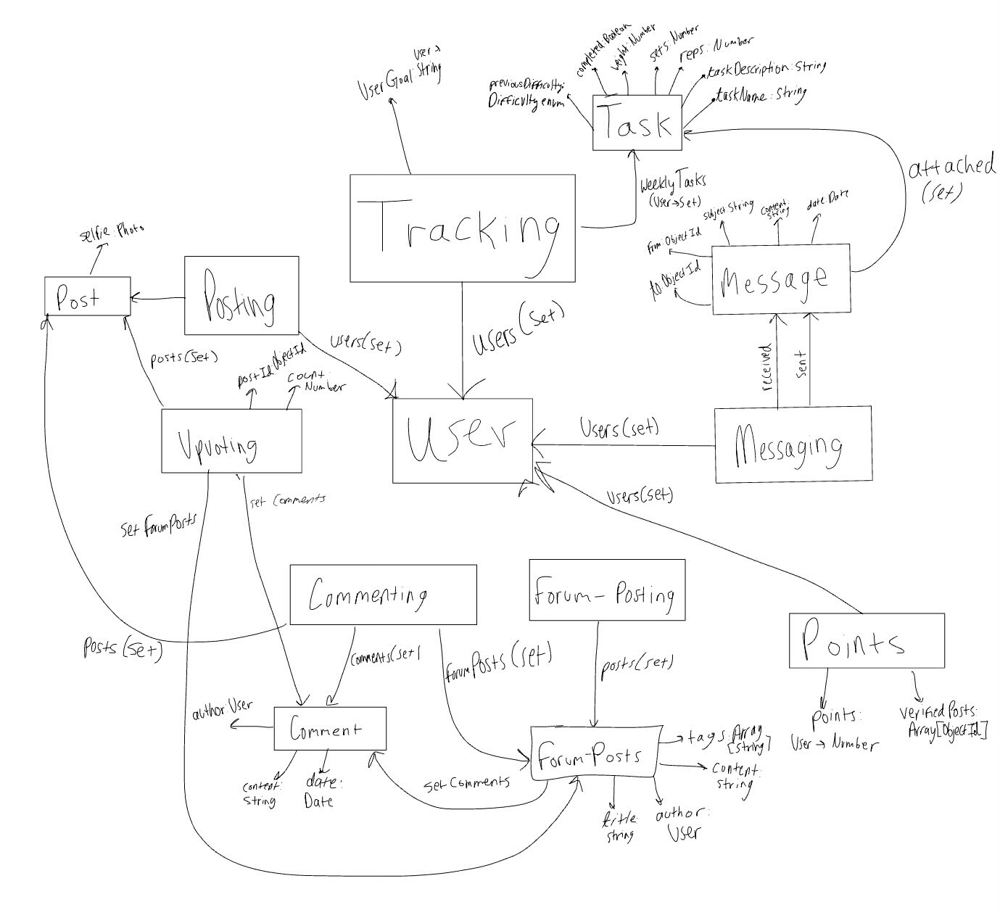
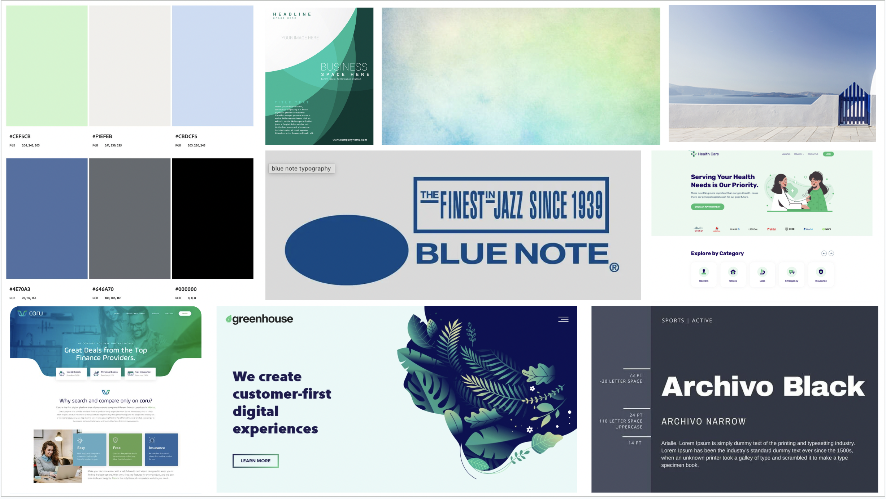
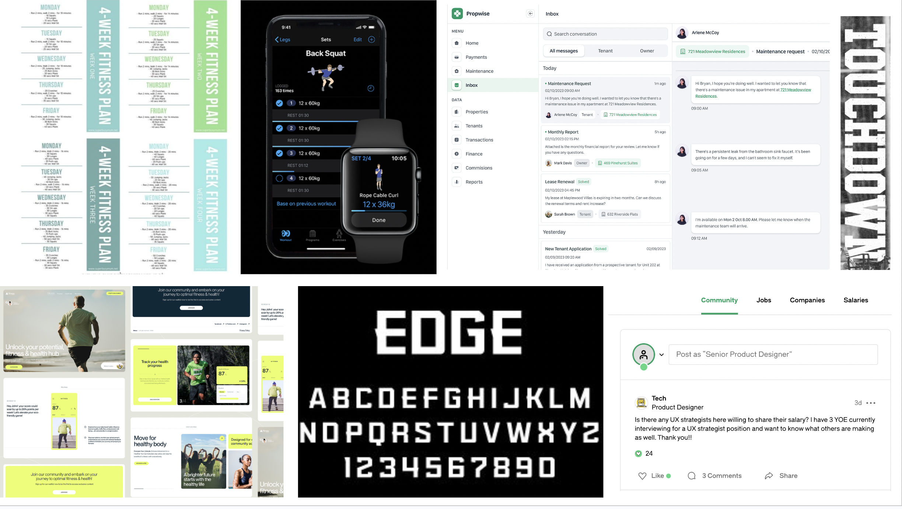

# **Project Phase 3: Convergent Design**

Binary Beasts

Claire Lorenzo, Cameron Young, Marcelo Maza, Fabian Yanez-Laguna

## Functional Design

**Concepts**

*Our application plans to make use of the following concepts, along with pre-existing starter concepts. We plan to modify the Posting concept by adding ‘selfie’ and ‘tags’ to the Post object.* 

* Tracking   
  * Purpose: track activity for a user  
  * Operating Principle: after a user completes a task, such as a meal or working out, they can track the task's completion by logging progress.  
  * States:  
    * users: set User  
    * userGoal: User \-\> String   
    * sharedUsers: User \-\> set User  
    * weeklyTasks: User \-\> set Tasks  
    * taskName: Task \-\> String  
    * taskDescription: Task \-\> String  
    * reps: Task \-\> Number  
    * sets?: Task \-\> Number  
    * weight?: Task \-\> Number  
    * completed: Task \-\> Boolean  
    * previousDifficulty: Task \-\> Difficulty enum \{Difficult, JustRight, Easy\}  
  * Actions:  
    * create (taskName:String, taskDescription: String, reps: Number, sets?: Number, startingWeight?: Number)  
      * adds new Task with properties to weeklyTasks  
    * update(taskName:String, reps?: Number, sets?: Number, weight?: Number)  
      * updates task with specified properties  
    * setUserGoal(goal:String):  
      * userGoal \= goal  
    * delete(taskName:String)   
      * taskName removed from weeklyTasks  
    * isCompleted(user: User, taskName:String)  
      * returns completed  
    * tasksCompleted(user: User):  
      * returns true if isCompleted(task) for all task  
    * setCompleted(taskName:String)  
      * completed \= completed ? False : True (set to the opposite)  
    * share(owner: ObjectId, sharedUser: ObjectId)  
      * adds sharedUser to sharedUsers in owner’s tracking doc  
    * promptChange(currentDifficulty Difficulty, userGoal: String)  
      * if previousDifficulty and currentDifficulty==Difficult, and userGoal is ‘muscle or endurance’, ask user if they would like to decrease weight by 5lbs.  
      * if both \== Difficult and userGoal is ‘strength’, suggest they decrease reps by 2  
      * if both \== Easy, increase weight for strength, suggest an increase in reps for muscle  
      * if JustRight, or any other combination, do not suggest anything  
      * save currentDifficulty to previousDifficulty  
* Messaging  
  * Purpose: Allows one-on-one interaction between users  
  * Operating Principle: users send a message to other users through an inbox.  
  * States:  
    * users: set User  
    * received: User \-\> set Message  
    * sent: User \-\> set Message  
    * to: Message \-\> ObjectId  
    * from: Message \-\> ObjectId  
    * subject: Message \-\> String  
    * content: Message \-\> String  
    * date: Message \-\> Date  
    * attached: Message \-\> Task (Optional)  
  * Actions:  
    * send(to:User, from:User, subject:String, content:String, attached?:Data)  
    * getMessages (for:User **out** Set(messages:Set\[Messages\]))  
    * getSent (from: User **out** Set(messages:Set\[Messages\])  
* Upvoting  
  * Purpose: Allow users to show approval on app content  
  * Operational Principle: users will press the upvote button to give an upvote  
  * States:  
    * posts: set Post  
    * comments: set Comment  
    * forumPosts: set ForumPost  
    * postId: Post, Comment, ForumPost \-\> ObjectId  
    * count: Post, Comment, ForumPost \-\> Number  
  * Actions:  
    * getCount(postId)  
      * returns count for corresponding postId  
    * addVote(id: ObjectId)  
      * count+=1  
    * removeVote(id: ObjectId)  
      * count+=1  
* Commenting  
  * Purpose: allow users to respond to app content  
  * Operational Principle: users press the comment button, type their comment, and post  
  * States:  
    * posts: set Post  
    * forumPosts: set ForumPost  
    * comments: ForumPost \-\> set Comment  
    * commentId: Comment \-\> ObjectId  
    * author: Comment \-\> User  
    * content: Comment \-\> String  
    * date: Comment \-\>Datetime  
  * Actions:  
    * postComment(post: Post, author: User, content: String)  
      * comments \+= new Comment(post, author, content)  
    * deleteComment(commentId: ObjectId, author: User)  
      * comments \-= comment with id commentId if author==comment.author  
* Forum-Posting  
  * Purpose: allow users to post any questions or advice on forum  
  * Operational Principle: users type in content and a title, assign appropriate tags, and then press post  
  * States:  
    * posts: set ForumPost  
    * postId: ForumPost \-\> ObjectId  
    * title: ForumPost \-\> String  
    * author ForumPost \-\> User  
    * content: ForumPost \-\> String  
    * tags: ForumPost \-\> Set String  
  * Actions:  
    * createPost(title, content, tags)  
    * deletePost(postId)  
    * getPostsWithTag(tag:String)  
      * returns posts with tag  
* Points  
  * Purpose: allow users to earn Wellness Points and compete against friends  
  * Operational Principle: users get wellness points for completing actions within the app  
  * States:  
    * users: set User  
    * points: User \-\> Number  
    * verifiedPosts: set ObjectId (of posts)  
  * Actions:  
    * awardFivePoints(selfie: Post, author: User, verifier: User)  
      * author.points+=5  
      * verifier.points \+= 1  
      * verifiedPosts \+= selfie  
    * awardOnePoint(author: User)  
      * author.points+=1  
    * getPoints(user: User)  
      * returns points for user  
    * checkIfAlreadyVerified(postId)  
      * return (postId in verifiedPosts)

**Synchronizations**

* Earning Wellness Points For Gym Posts  
  * User Actions:  
    * Friending.sendRequest/acceptRequest to add friends (who will verify posts)  
    * for each task in weeklyTasks: Tracking.setCompleted(taskName: string)  
    * if Tracking.tasksCompleted(user), users are prompted to take a selfie at the gym  
    * selfie \= Posting.create(author: ObjectId, content: string, selfie:Photo)  
  * Friend Actions:  
    * Upvoting.addVote(postId of selfie)  
    * if Upvoting.getCount(postId of selfie):  
      * Points.awardFivePoints(selfie, user, friend)  
* Adding Recommended Exercises from Friends  
  * Messaging.send(user1, user2, ‘new exercise’, ‘try this\!’, newExercise: Task)  
  * Tracking.create(newExercise.taskName, newExercise.taskDescription, newExercise.reps?, newExercise.sets?, startingWeight?)   
* Earning Wellness Points For Commenting:  
  * Commenting.postComment(post, author, “”)  
  * count \= Upvoting.getCount(comment.commentId)  
  * if count \> 5:  
    * Points.awardOnePoint(author)  
* Earning Wellness Points For Forum-Post  
  * ForumPosting.createPost(title, author, tags)  
  * count \= Upvoting.getCount(post.postId)  
  * if count \> 5:  
    * Points.awardOnePoint(author)

**Dependency Diagram**  

## Wireframes

[Wireframe](https://www.figma.com/design/WZdmW26hcITQfsOFeTydTf/6.1040-Project?node-id=13-42&t=RswVyj2vuJzprSQS-1)

## Heuristic Evaluation

Usability Criteria:

* **Efficiency:** Since our app is a fitness and wellness app, it’ll be important for users to be able to log things about their workout as they go as needed, and for them to post about things or ask questions quickly. Therefore, efficiency will be an important heuristic for our app. As seen in our wireframes, each main functionality of our application is in a different page, making it clear and efficient for users how to quickly go from one task to another using the nav bar. Increasing efficiency may introduce the tradeoff of designing things in a visually pleasant way vs. making things quick to use and access.  
* **Pleasantness:** Similarly to a lot of fitness tools, our app is meant to motivate people to stay fit and healthy, and promote exercise as well as community encouragement. This will be difficult to do if people do not want to use the app if it is visually pleasing. Again, making things very visually pretty while keeping all functionality extremely obvious for all types of users and keeping things efficient can be difficult, so we will have to deal with this tradeoff when designing our front end. Right now, as seen in our wireframes as well as our two slides, we have chosen a color palette that is calming but bright and encouraging to increase the pleasantness of the app; we are also planning on using “sporty” fonts that motivate users to log their progress. We may want to further elaborate our styling when we move on to that step to increase pleasantness, because so far our wireframes only cover main functionality and color scheme.

Physical Heuristics:

* **Situational context:** As mentioned above, situational context is important for users to be able to efficiently go from one task to another, and something we tried to make very obvious in our wireframes. By making most separate functionality into its own section or page (all accessible through the nav bar), and bolding the page that the user currently is on, situational context is made obvious. We also added highlighting in lighter colors (for example, in threads), when an object is selected, to enable users to navigate from one item to the next with ease. One thing we have not always done in our wireframes is add page titles on the page itself to increase situational context further, but this will be something we will consider later on if ever we think it is impairing users to identify where in our app they are, because this may make the website not as visually appealing if there is too much big text. This heuristic goes along with our efficiency heuristic, because both make user actions and movement within the app a lot easier.  
* **Mapping**: We chose mapping as a heuristic because we have several different pages that may not always have visually distinct functionality (for example, seeing a message vs seeing a forum post). Therefore, writing a message vs writing a forum post or posting a picture should all look at least slightly different. Although this is simplified by having things in separate pages, we will want to work more on that as we go into front end design because so far we have a simplified version of this mapping within our wireframes. Mapping may be 

Linguistic Level

* **Speak a user’s language:** As described earlier in our usability criteria, it will be important for the user to feel in control and knowledgeable about how to deal with errors within the app, because they have to do a lot of logging and potentially posting; user input will be very frequent, and so the tolerance for non understandable error messages and communication in general will not be very high. This is something that we have not pictured in our wireframes, but that will be essential to the error handling in our app. This heuristic might also somewhat be a tradeoff with pleasantness, because users must understand immediately if their logs and posts are not going through, and error messaging or app to user communication may not always be very pleasant visually.  
* **Consistency:** Within our app, since most concepts are on their own page (except for scoring, as seen in the wireframes), it will be pretty simple to keep consistency for concepts. We are also sticking to typical symbols and names for our concepts that resemble other apps. For example, as we can see in the posts page, like symbols are a thumbs up similar to social media apps, and same thing with threads and other symbols within our app.

## Design Iteration

Focusing on Fitness

- To remove concerns about HIPAA violations and provide more opportunity for novelty, we removed any features involving health professionals and chose to focus our features on fitness. We removed the following concepts related to the removal of these features: Scheduling and Verifying. Additionally, we removed concepts such as Prescribing and Planning by combining them with Messaging and Tracking respectively. 

Emphasis on Motivation \+ Information

- Since we decided to remove any features involving health professionals, we’ve switched our app’s focus to assist newcomers in fitness through providing motivation and information. To provide motivation, we’ve introduced new social features such as leaderboards, gym selfies for accountability, and points for interactions. To provide more information, we’ve fleshed out our forum concepts and plan on incorporating relevant forum posts into each user’s tracker.

Inboxes

- Rather than implementing text messaging, we decided our messaging feature should work similar to emails. With this, we also plan to send automated messages to users through their inbox to provide progress checks and forum posts they may be interested in. 

Automatic Regimen Modifications

- Users will be asked to set a goal when first creating their regimen—do they wish to improve their strength, endurance, or build muscle. When a user reports that an exercise is too easy or too difficult twice in a row, this is an indication that either reps or weight should be modified. The app will suggest weight or rep changes based upon a user’s goals and difficulty reports. This will ensure that newcomers to the gym are making proper adjustments to their workouts to maximize progress. Users will never be forced to make these changes.

Automatic forum recommendations

- When tracking their exercises, new users might lack knowledge of certain exercises. For instance, they might not know the proper form or they might not know what exercises to do in the first place. Based on the keywords in the description and name of logged exercises, we can filter relevant forum posts and show them to the users on the tracking page, in addition to having all of the forums on a page solely dedicated to forums. 

Wellness points validity 

- When logging exercises, some users may log fake exercises to gain more points. To prevent this from happening, at least one other user must upvote/like the post in order to verify its validity. This way, the point system is more likely to be accurate and users will be more deterred from lying.

## Visual Design Study

## Implementation Plan

Concepts to implement in order, split up by tasks:

1) Tracking  
   1) Back-end: Cam by Nov. 25th at 11:59PM  
   2) Front-end: Claire by Nov. 27th at 11:59PM  
2) Forum Posting  
   1) Back-end: Fabian by Nov. 25th at 11:59PM  
   2) Front-end: Marcelo by Nov. 27th at 11:59PM  
3) Messaging  
   1) Front-end and back-end : Cam by Dec. 3rd at 11:59PM  
4) Commenting  
   1) Front-end and back-end : Claire by Dec. 3rd at 11:59PM  
5) Upvoting  
   1) Front-end and back-end : Fabian by Dec. 3rd at 11:59PM  
6) Points  
   1) Front-end and back-end : Marcelo by Dec. 3rd at 11:59PM  
7) Posting  
   1) Adding photos: Fabian (if time permits by Dec 5th at 11:59PM)  
8) Styling: Cam, Claire, Marcelo by Dec 5th at 11:59PM

Within the first week (Alpha submission), if the backend is taking longer than expected, the people working on the front-end will assist with making things go faster, and same thing for if the front-end is taking too long and we may miss the deadline. People may also switch tasks if needed if one person becomes available early in the week and there is a dependency for that task later in the week. For the second week, we are each working on our own concept, but will help each other out and adapt our plan as needed. We are intending on prioritizing having our full app being functional rather than having less concepts and more styling. If we need more time for styling, we can also drop certain features if needed. However, we plan to implement all the concepts described above. If creating an inbox for messaging causes complications, we will revert to doing a text message chat instead. Additionally, some functionality such as sending Tasks may be dropped. Additionally, if adding photos to posts does not work, we may remove that entirely and instead have people give reflections on their workouts rather than a selfie.